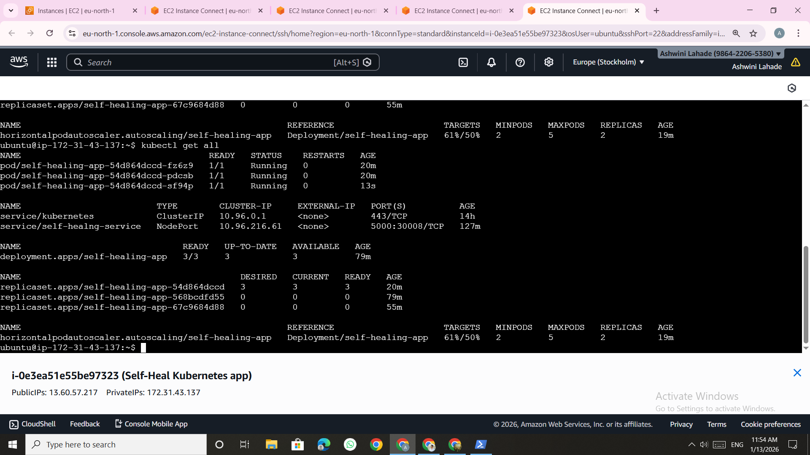
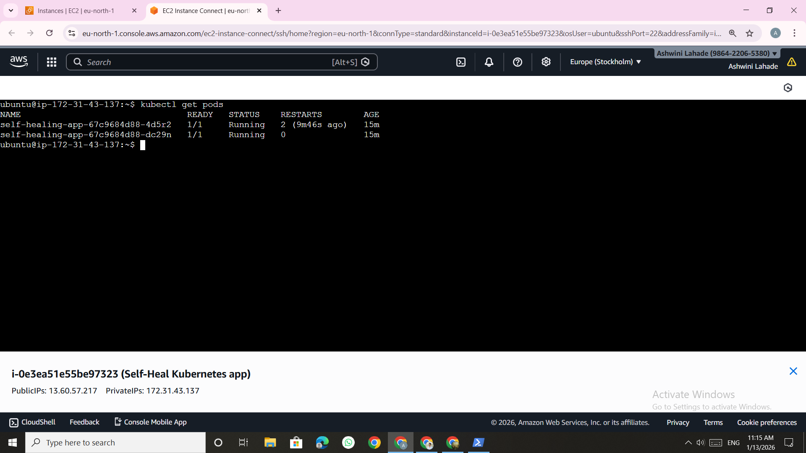
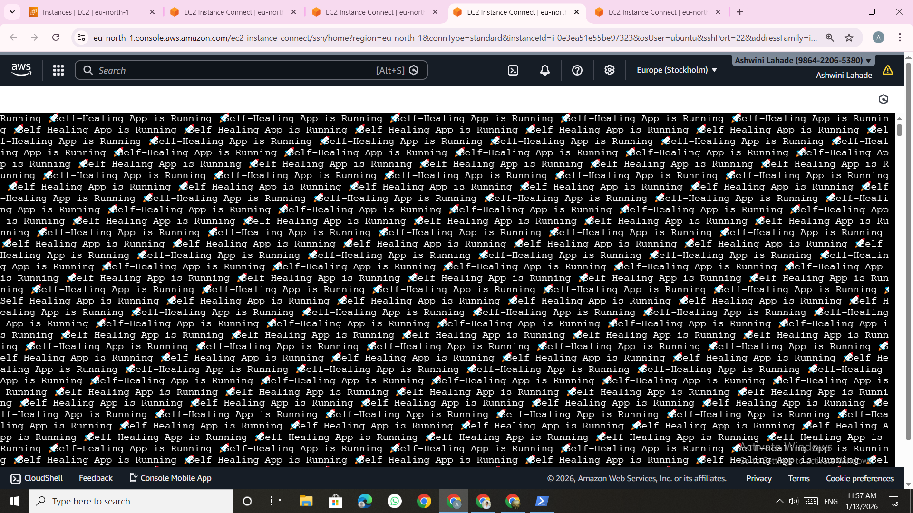
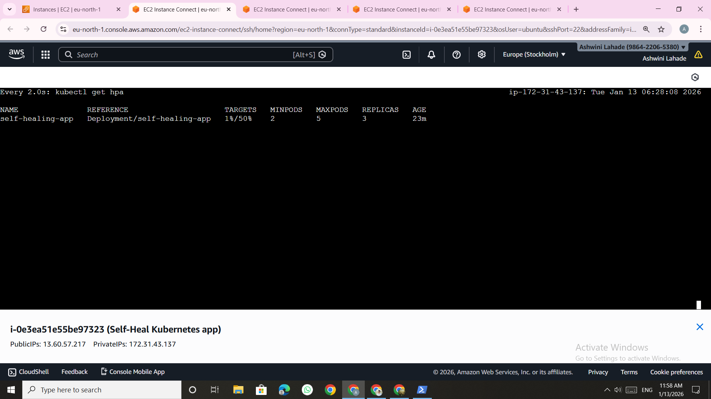
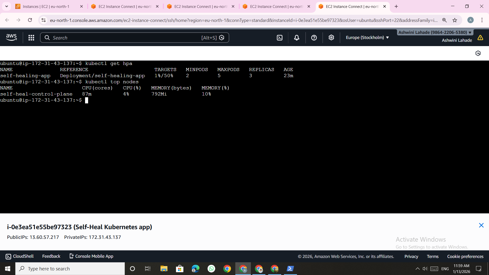

#  Project 2 — Self‑Healing & Auto‑Scaling Kubernetes Application

This project demonstrates **Kubernetes self‑healing and auto‑scaling** using liveness/readiness probes and **Horizontal Pod Autoscaler (HPA)**. It is designed to showcase **production‑grade reliability patterns** and is fully reproducible.

---

##  Objectives

* Prove **self‑healing**: pods automatically restart on failure
* Prove **auto‑scaling**: pods scale based on CPU utilization
* Use **KIND** for local Kubernetes and **metrics‑server** for HPA

---

##  Architecture Overview

User Traffic → Kubernetes Service → Deployment (Replicas)
→ Liveness/Readiness Probes → Auto‑Restart
→ Metrics Server → HPA → Auto‑Scaling

---

## 🛠️ Tech Stack

* Kubernetes 
* Docker
* Python (Flask)
* metrics‑server
* Horizontal Pod Autoscaler (HPA)
* Linux (Ubuntu)

---

## 📁 Repository Structure

```
self-healing-k8s-app/
│
├── app/
│   └── app.py
├── docker/
│   └── Dockerfile
├── kubernetes/
│   ├── deployment.yml
│   ├── service.yml
│   └── hpa.yml
├── screenshots/
└── README.md
```

---

## ⚙️ Application

The Flask application exposes two endpoints:

* `/` — normal healthy response
* `/crash` — intentionally crashes the container using `os._exit(1)`

This allows controlled testing of Kubernetes self‑healing.

---

## 🐳 Build & Load Image

```bash
docker build -t self-healing-app:1.0 -f docker/Dockerfile .
kind load docker-image self-healing-app:1.0 --name cicd-cluster
```

---

## ☸️ Kubernetes Deployment

```bash
kubectl apply -f kubernetes/deployment.yml
kubectl apply -f kubernetes/service.yml
```

Verify:

```bash
kubectl get pods
kubectl get svc
```

---

## ♻️ Self‑Healing Test

1. Port‑forward the service:

```bash
kubectl port-forward svc/self-healng-service 30008:5000
```

2. Trigger a crash:

```bash
curl http://localhost:30008/crash
```

3. Observe automatic restart:

```bash
kubectl get pods
```

✅ Kubernetes restarts the crashed pod automatically.

---

## 📊 Metrics & HPA Setup

### Install metrics‑server (KIND compatible)

```bash
kubectl apply -f https://github.com/kubernetes-sigs/metrics-server/releases/latest/download/components.yaml
```

Patch metrics‑server for KIND:

```bash
kubectl patch deployment metrics-server -n kube-system \
--type='json' \
-p='[
  {"op":"add","path":"/spec/template/spec/containers/0/args/-","value":"--kubelet-insecure-tls"},
  {"op":"add","path":"/spec/template/spec/containers/0/args/-","value":"--kubelet-preferred-address-types=InternalIP"},
  {"op":"add","path":"/spec/template/spec/containers/0/args/-","value":"--metric-resolution=15s"}
]'
```

Verify metrics:

```bash
kubectl top pods
```

---

## 📈 Enable Auto‑Scaling (HPA)

Ensure CPU requests are set in the Deployment, then create HPA:

```bash
kubectl autoscale deployment self-healing-app \
--cpu-percent=50 \
--min=2 \
--max=5
```

Check HPA:

```bash
kubectl get hpa
```

---

## 🔥 Auto‑Scaling Test

Generate load:

```bash
while true; do curl http://localhost:30008; done
```

Watch scaling:

```bash
kubectl get hpa -w
```

✅ Replicas increase automatically based on CPU usage.

---

## 📸 Screenshots

### Pods Running


### App Running 


### Self-Healing (Pod Restart)


### Metrics Server Working


### HPA Created


### Auto-Scaling in Action


---

## 🧠 Key Learnings

* Kubernetes automatically restarts failed containers
* Liveness & readiness probes are critical for reliability
* HPA depends on metrics‑server and CPU requests
* KIND requires special configuration for metrics

---

## 🎤 Interview Ready Summary

> “I built a self‑healing and auto‑scaling Kubernetes application using liveness probes, metrics‑server, and HPA, and validated it by simulating crashes and CPU load.”

---

## ✅ Status

**Completed and production‑ready** 🚀
VPA will be added soon
